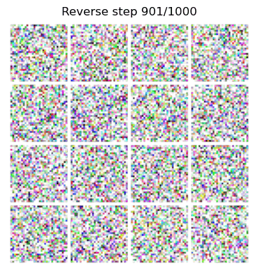
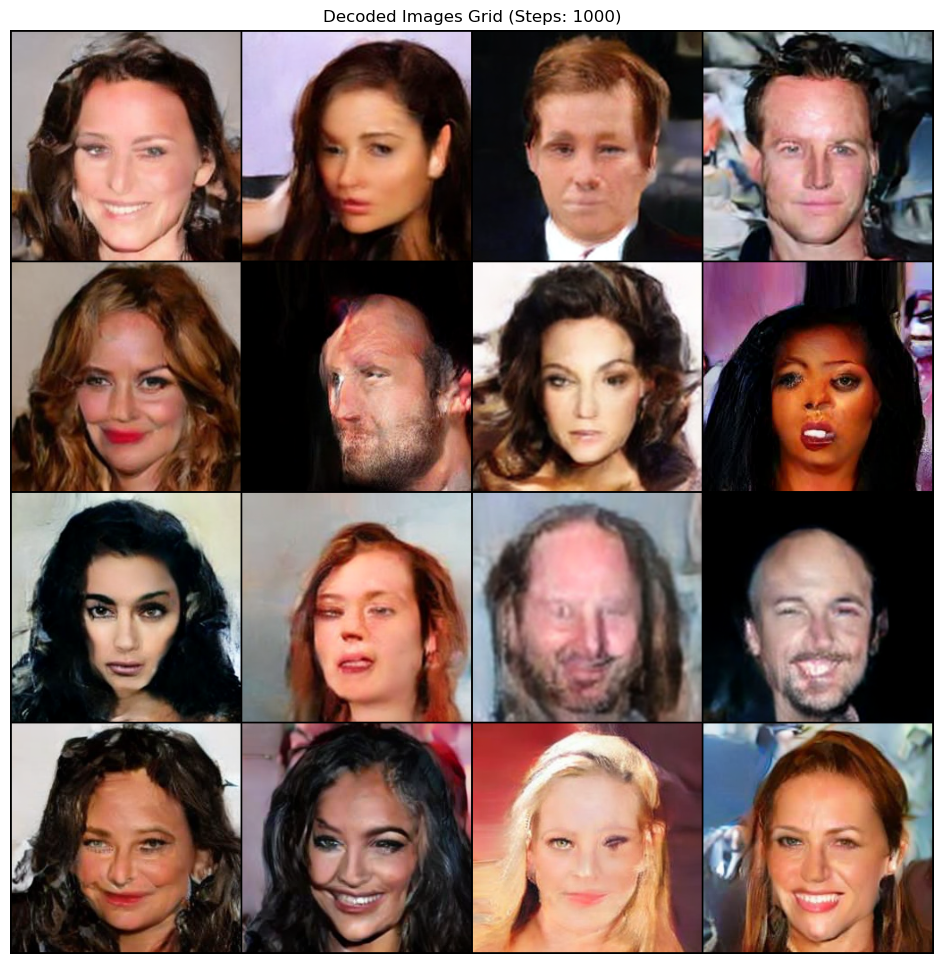
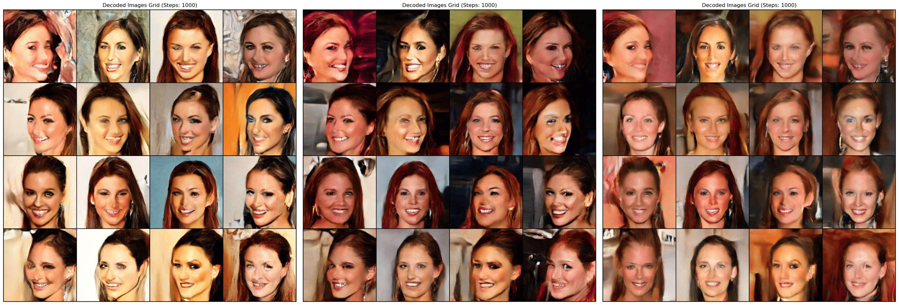

# Hands-on Generative AI: Latent Diffusion Model Implementation

## Project Overview

This repository contains an implementation from scratch of a Latent Score-based Diffusion Model (LDM). The primary objective is to develop a functional LDM capable of effective deployment under limited computational resources. The implementation operates in a compressed latent space using a pretrained Variational Autoencoder (VAE) to reduce cost while maintaining perceptual quality. 

The project explores three specific Stochastic Differential Equation (SDE) formulations: Variance Preserving (VP), Variance Exploding (VE), and subVP. Training incorporates standard score matching, Likelihood Weighting (LW), and Importance Sampling (IS) to optimize the learning of the score function. Conditional generation is achieved through Classifier-Free Guidance (CFG).

---
<table align="center">
  <tr>
    <td valign="top">
      
    </td>
    <td valign="top">
      
    </td>
  </tr>
</table>

  <em>
    Reverse diffusion sampling for VP with Likelihood Weighting + Importance Sampling in latent space (left).
    Decoded output shown as a fixed reference (right).
  </em>

  
   
  <em>Qualitative comparison across SDE formulations: VP, subVP, and VE, from Left → Right, respectively. Using the same sampling budget.</em>

---

## Project Structure and File Descriptions

The project follows a modular design for reproducibility and experiment tracking using PyTorch Lightning and Weights & Biases.

### Top-Level Files and Directories

| File/Directory | Description |
| :--- | :--- |
| **`train.py`** | Main execution script. Handles argument parsing, configuration loading, and initializes the PyTorch Lightning trainer. |
| **`test.py`** | Script for evaluating trained models through the computation of Negative Log-Likelihood (NLL), Fréchet Inception Distance (FID), and Inception Score (IS), as well as generating samples. |
| **`requirements.txt`** | List of dependencies including `torch`, `pytorch-lightning`, and `wandb`. |
| **`experiments/`** | Contains `.yaml` files, such as `base_config.yaml`, defining hyperparameters like learning rates, batch size, others and SDE related parameters. |
| **`notebooks/`** | Jupyter notebooks for testing reverse diffusion processes (e.g., `Reverse_Process_Test.ipynb`, `MNIST_Reverse_Test.ipynb`). |
| **`src/`** | Core source code directory containing model architectures and training logic. |

### Source Code Details (`src/`)

#### `src/models/` (Model Architectures)

| File | Function |
| :--- | :--- |
| **`UNet.py`** | Implements the denoising U-Net backbone with a symmetric encoder-decoder structure. |
| **`components.py`** | Defines modular building blocks including Residual Blocks, Self-Attention layers, and Strided Convolution modules. |

#### `src/training/` (Training Logic)

| File | Function |
| :--- | :--- |
| **`ldm_module.py`** | The main `LightningModule` wrapper. It encapsulates the training procedure and the objective function. |

#### `src/utils/` (Utilities and SDE Logic)

| File | Function |
| :--- | :--- |
| **`WIP_SDE.py`** | Contains the mathematical formulations for VP, VE, and subVP SDEs, including drift and diffusion coefficients necessary for both forward and reverse process. |
| **`WIP_processes.py`** | Contains the actual implementation of the forward and reverse diffusion processes, while relying on `WIP_SDE.py` mathematical formulation. |
| **`sde_utils.py`** | Contains some utilities, specifically those for the computation and implementation of the Importance Sampling. |
| **`vae_utils.py`** | Utilities for interfacing with the pretrained VAE (`stabilityai/sd-vae-ft-mse`) used for encoding and decoding. |
| **`utils.py`** | General helper functions for the project, particularly important for the definition of the training setup. |

---

## Phased Implementation Plan

The development is structured into three distinct phases to ensure modular testing and progression.

| Phase | Focus | Key Deliverable |
| :--- | :--- | :--- |
| **Phase 1: Architecture Setup** | Implementation of U-Net core components from scratch, including downsampling, bottleneck, and upsampling modules. | A runnable U-Net backbone. |
| **Phase 2: Unconditional LDM** | Implementation of forward and reverse SDE processes. Training the U-Net unconditionally on latent representations. | Model capable of generating images from pure noise. |
| **Phase 3: Conditional Generation** | Integration of conditioning signals and implementation of Classifier-Free Guidance (CFG). | Fully functional conditional LDM. |
